## Automated ELK Stack Deployment

The files in this repository were used to configure the network depicted below.

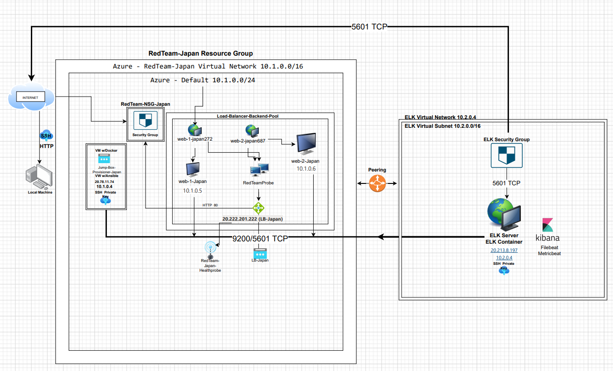

These files have been tested and used to generate a live ELK deployment on Azure. They can be used to either recreate the entire deployment pictured above. Alternatively, select portions of the YAML file may be used to install only certain pieces of it, such as Filebeat.

_See playbook file below._

[Filebeat playbook](Ansible/filebeat-playbook.yml)

 This document contains the following details:
- Description of the Topology
- Access Policies
- ELK Configuration
  - Beats in Use
  - Machines Being Monitored
- How to Use the Ansible Build


### Description of the Topology

The main purpose of this network is to expose a load-balanced and monitored instance of DVWA, the D*mn Vulnerable Web Application.


_What aspect of security do load balancers protect?_
- Load balancing ensures that the application will be highly secure, in addition to restricting traffic to the network. 
- Load balancers allow for prevention of DDoS attacks and assist organizations in shifting attack traffic from corporate servers and into public cloud providers. 
- Allows for flexibility and ensures efficency while ensuring that no one server is overloaded.
- There are 4 types of load balancers which include the following: Application Load Balancer, Network Load Balancer, Classic Load Balancer, Gateway Load Balancers.

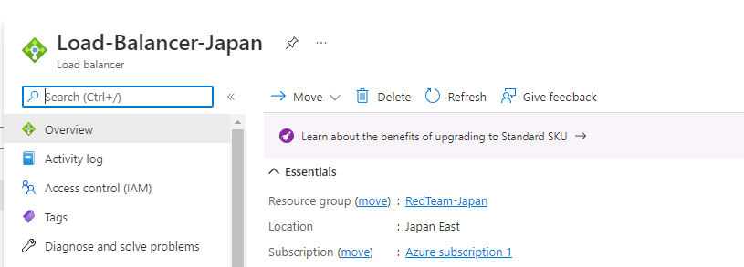

_What is the advantage of a jump box?_
- Manages machines in other security groups and is a great tool that increases security.
- Allows for admin access before connecting to another machine.
- Used as a jumping point or gateway into another machine 
- Acts as a buffer before any other network traffic is allowed. 

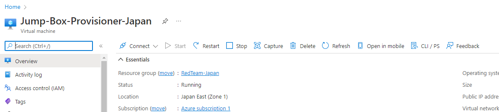

Integrating an ELK server allows users to easily monitor the vulnerable VMs for changes to the data and system logs.

_What does Filebeat watch for?_

Filebeat centralizes logs and files and forwards them while monitoring locations specified by the user, collects log events, and forwards them either to Elasticsearch or Logstash for indexing.

_What does Metricbeat record?_

Metricbeat collects metrics from your systems and services and then ships them to the output that you specify, such as Elasticsearch or Logstash. it also helps you monitor your servers by collecting metrics from the system and services running on the server.

The configuration details of each machine may be found below.

| Name     | Function | IP Address | Operating System |
|------------------------|---------------|---------------------|------------------|
| Jump-Box-Provisioner   | Gateway       | 20.78.11.74;10.1.0.4| Linux            |
| ELK-VM                 | Kibana        | 10.2.0.4            | Linux            |
| Web-1                  | Webserver     | 10.1.0.5            | Linux            |
| Web-2                  | Webserver     | 10.1.0.6            | Linux            |
| Load-Balancer-Japan    | Load Balancer | 20.222.201.222      | DVWA             |

### Access Policies

The machines on the internal network are not exposed to the public Internet. Only the jump-box machine can accept connections from the Internet. Access to this machine is only allowed from the following IP addresses: 

_Machines within the network can only be accessed by SSH key via the Jump Box via 20.78.11.74._

A summary of the access policies in place can be found in the table below.

| Name                 | Publicly Accessible | Allowed IP Addresses |   |   |
|----------------------|---------------------|----------------------|---|---|
| Jump-Box-Provisioner | Yes                 | 20.78.11.74          |   |   |
| ELK-WM               | Yes                 | 20.213.8.197         |   |   |
| Web-1                | No                  | 10.1.0.5             |   |   |
| Web-2                | No                  | 10.1.0.6             |   |   |

### Elk Configuration

Ansible was used to automate configuration of the ELK machine. No configuration was performed manually, which is advantageous because ansible doesn't take any coding skills to use, it's a very powerful tool that allows for complexity , but is also very flexible. Ansible is very secure and reliable because it's an agentless configuration that uses SSH and transfers the bare minimum of data to machines that it manages.

The playbook implements the following tasks:
- Create the virtual network with peer conenctions from the pervious Azure setup.
- Create the ELK VM that will be accessed from the previously made Jump-Box.
- Install Docker then locate and start the ansible container then connect the container with the appropriate SSH key.
- Download and configure the container by updating the ansible host file.
- After the docker is installed, the container needs to be downloaded and then exposed

The below screenshot shows the setup of the docker container below.

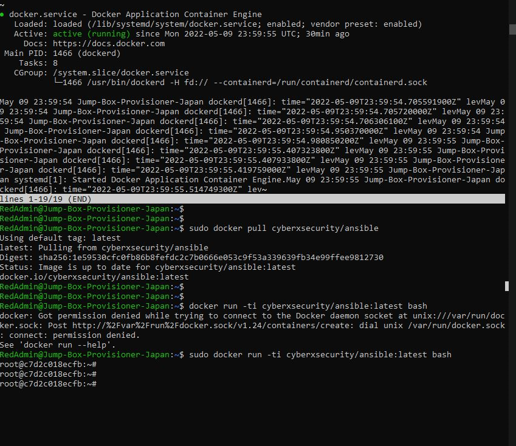

The following screenshot displays the result of running `docker ps` after successfully configuring the ELK instance.

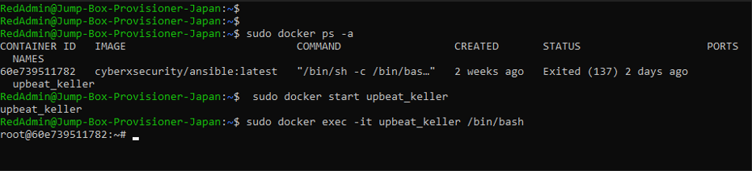


### Target Machines & Beats
This ELK server is configured to monitor the following machines:
- Web-1: 10.1.0.5 ; DVWA-1
- Web-2: 10.1.0.6 ; DVWA-2

_File for configureing the web hosts._

```
  ---
 - name: Config DVWA
   hosts: webservers
   become: true
   tasks:

   - name: Install docker.io
     apt:
       update_cache: yes
       name: docker.io
       state: present

   - name: Install pip3
     apt:
       name: python3-pip
       state: present

   - name: Install Python Docker Module
     pip:
       name: docker
       state: present

   - name: download and launch a docker web container
     docker_container:
       name: dvwa
       image: cyberxsecurity/dvwa
       state: started
       restart_policy: always
       published_ports: 80:80
  ```

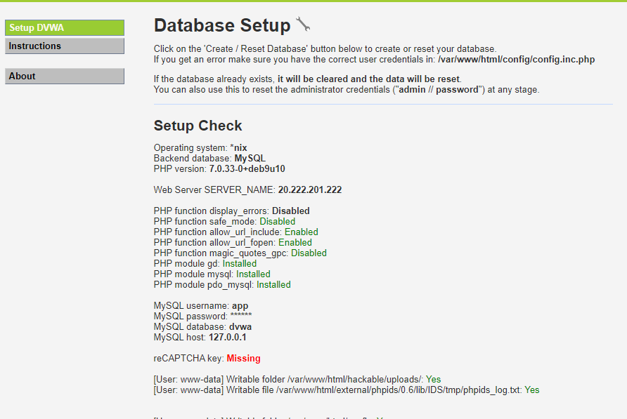

We have installed the following Beats on these machines:
- Filebeat
- Metricbeat

_Filebeat Installation_

The installation involves a string of commands along with execution of the playbook.

These Beats allow us to collect the following information from each machine: 
- Filebeat is collecting log events.
- Metricbeat is collecting metrics and statistics.

### Using the Playbook

In order to use the playbook, you will need to have an Ansible control node already configured. Assuming you have such a control node provisioned: 

SSH into the control node and follow the steps below:

- Run the following command.
```
ssh RedAdmin@20.78.11.74

```


- Copy the configuration file for filebeat-playbook.yml file to your ansible container.

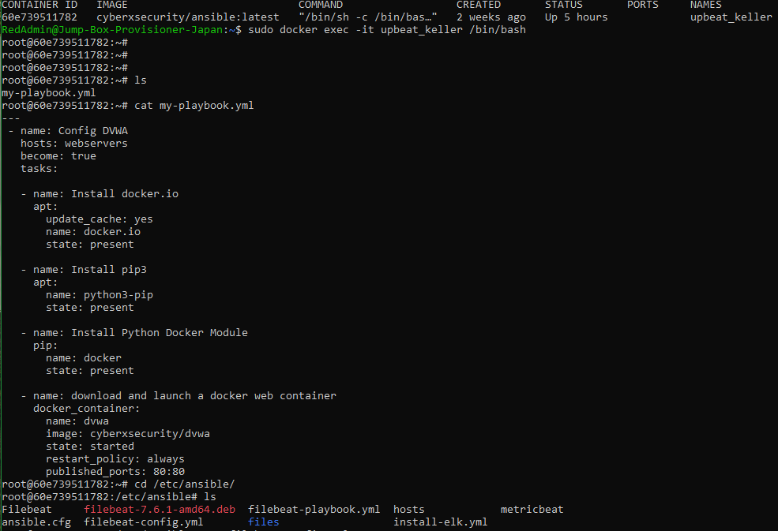

- Update the hosts file to include webservers.

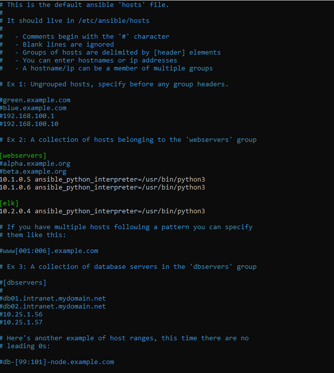

- Verify that that ELK-VM is accesable.

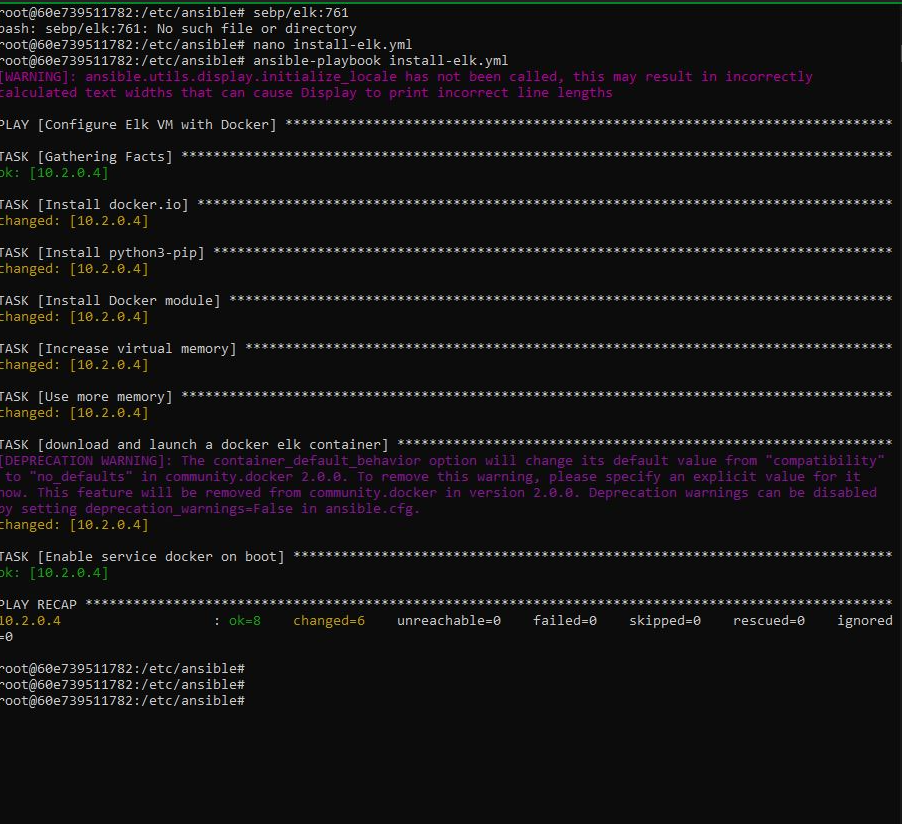

- Run the playbook, and navigate to ELK-VM to check that the installation worked as expected.

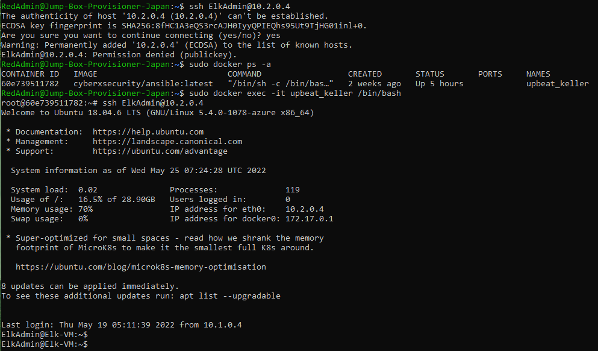

Check http://Your-ELK-VM-PUBLIC-IP:5601/app/kibana. You will replace Your-ELK-VM-PUBLIC with the public Ip of your ELk VM. You'll see the following page.

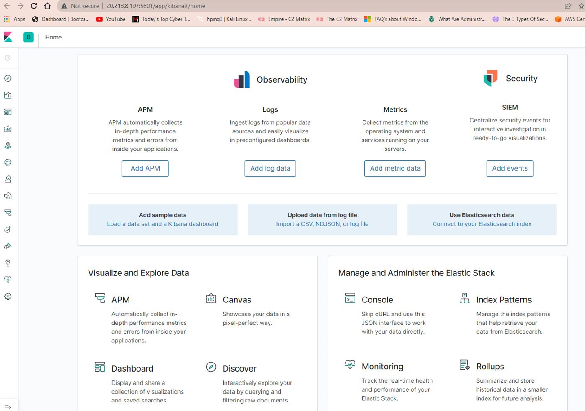


